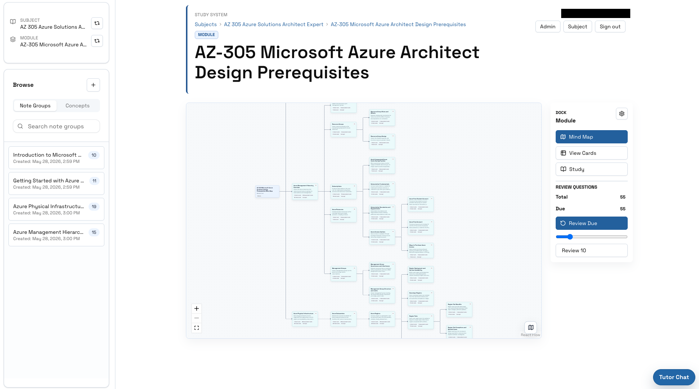
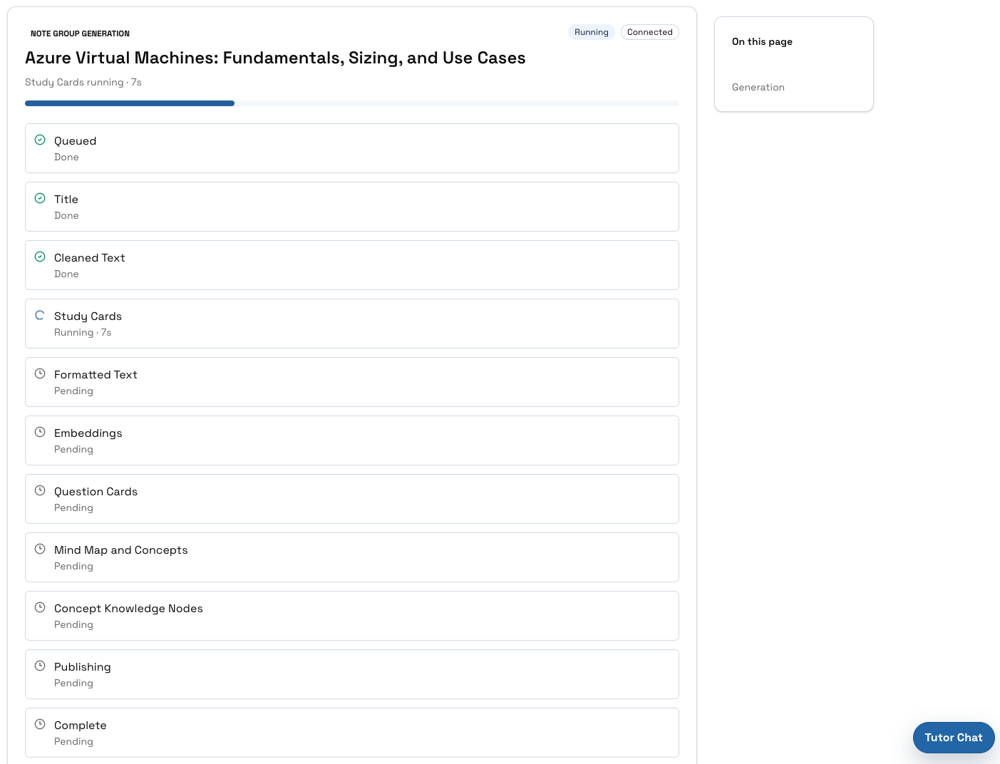
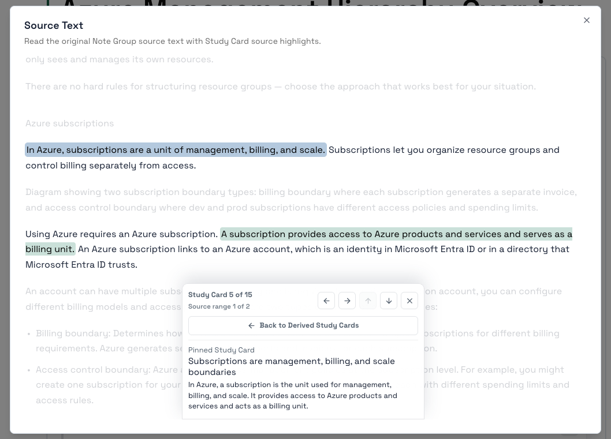
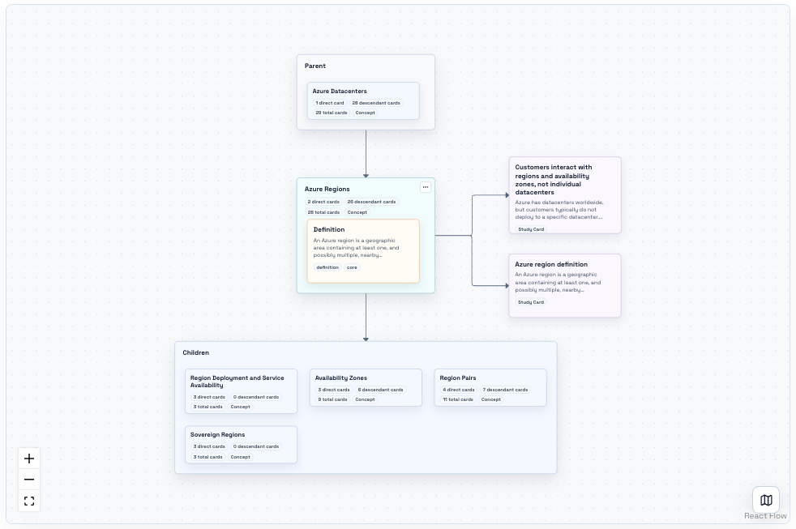
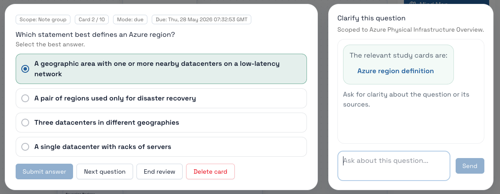
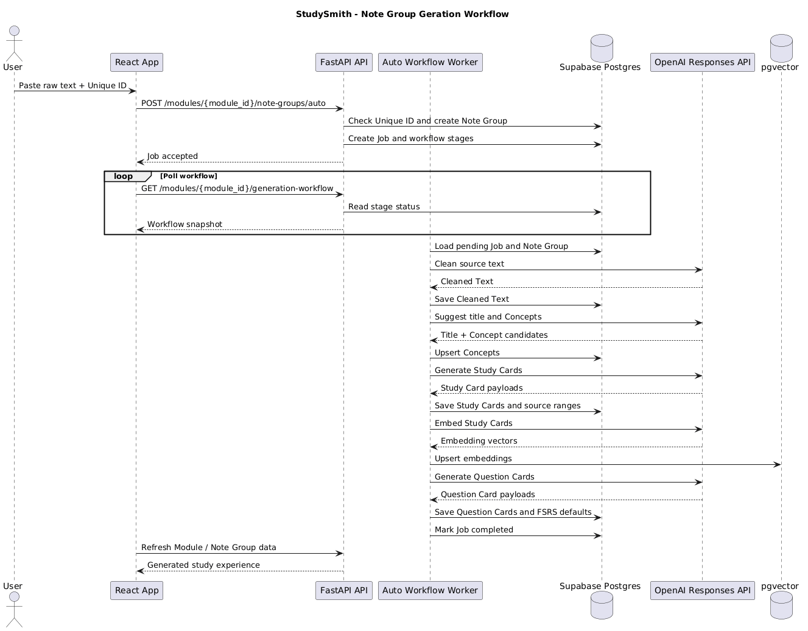
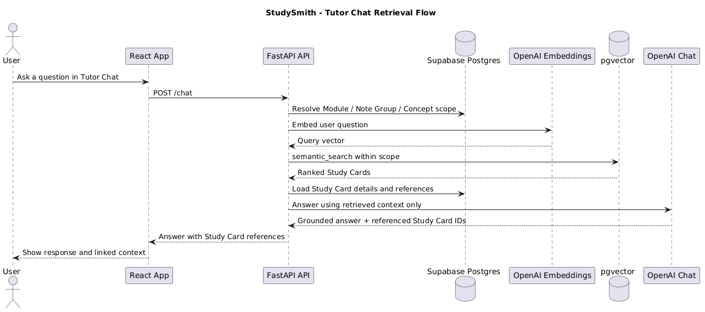
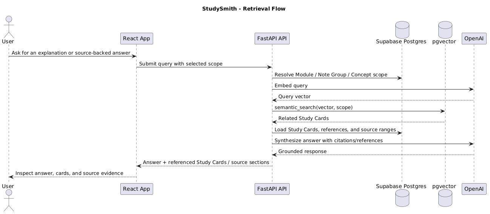

# StudySmith

StudySmith is an AI-assisted learning workspace that turns raw study material
into structured Study Cards, source-grounded Question Cards, review schedules,
Concept maps, and Tutor Chat.

The product goal is simple: paste serious source material once, then study,
review, inspect provenance, and ask questions from the same knowledge objects.

## What It Does

- Cleans raw notes into readable source-preserving markdown.
- Generates atomic Study Cards and linked Question Cards.
- Schedules review with FSRS.
- Embeds Study Cards in pgvector for semantic retrieval.
- Builds module and Concept mind maps from generated knowledge.
- Lets users inspect the source text behind generated cards.
- Answers Tutor Chat questions using retrieved Study Card context.
- Supports public read-only study pages and authenticated creator workflows.

## Product Shape

```text
Subject
`-- Module                         review and retrieval boundary
    `-- Note Group                  one source chunk or study session
        |-- Cleaned Text            preserved source material
        |-- Formatted Sections      source reading view aligned to Study Cards
        |-- Study Cards             retrieval source of truth
        `-- Question Cards          FSRS-scheduled assessment artifacts
```

## Why This Project Is Interesting

StudySmith is not a thin wrapper around a chat box. It has a domain model, a
background generation workflow, provenance tracking, spaced repetition, and a
retrieval layer that all point back to the same Study Card objects.

The engineering work is mostly in the coordination:

- keeping generated artifacts inspectable and editable;
- avoiding vague "AI output" blobs by modeling Subjects, Modules, Note Groups,
  Concepts, Study Cards, Question Cards, source ranges, review state, and jobs;
- handling long-running AI generation as resumable background workflow stages;
- making Tutor Chat retrieval scoped to a Module, Note Group, or Concept;
- preserving public read access while keeping creator actions authenticated.

## Product Walkthrough

StudySmith is built around a small set of connected workflows:



- the Module workspace organizes Note Groups, Concept maps, review state, and
  Tutor Chat from one view;



- the Auto Workflow turns raw source text into cleaned text, Study Cards,
  Question Cards, embeddings, and review-ready artifacts;



- the Source Text view keeps generated Study Cards tied to their supporting
  source ranges;



- Concept pages aggregate Study Cards across Note Groups for focused study and
  review;



- Tutor Chat retrieves from Study Cards, so answers can point back to the same
  knowledge objects used for review.

## Architecture

```text
React + Vite SPA
       |
       | REST JSON
       v
FastAPI application
       |
       | SQLAlchemy ORM
       v
Supabase Postgres
       |
       +-- pgvector Study Card embeddings
       +-- Supabase Auth
       +-- OpenAI generation, chat, and embeddings
       +-- Background Auto Workflow worker
```

| Layer | Technology |
| --- | --- |
| Frontend | React 18, Vite, React Router, Tailwind CSS |
| Backend | FastAPI, SQLAlchemy, Pydantic |
| Database | Supabase Postgres |
| Vector search | pgvector |
| AI | OpenAI Responses API and embeddings |
| Review scheduling | FSRS |
| Deployment | Docker image served as one Render Web Service |

## Key Workflows

### Auto Workflow

1. User creates a Note Group from raw text.
2. The backend checks source uniqueness and starts a background job.
3. OpenAI cleans the text, proposes Concepts, generates Study Cards, and creates
   Question Cards.
4. Study Cards are embedded into pgvector.
5. The UI polls workflow state and renders generated material as it becomes
   available.



### Tutor Chat And Retrieval

Tutor Chat answers from Study Cards, not directly from a free-form prompt. The
retrieval boundary defaults to the Module and can narrow to a Note Group or
Concept.




### Retrieval Flow

The retrieval path combines exact scope selection with semantic search over
embedded Study Cards. This keeps chat responses and review context tied to the
same source-backed knowledge model.



## Repository Map

```text
backend/
  app/
    main.py              FastAPI routes and static frontend serving
    models.py            SQLAlchemy domain models
    jobs.py              Auto Workflow execution
    openai_client.py     OpenAI generation, chat, and embeddings
    vector_store.py      pgvector persistence and retrieval
    fsrs_utils.py        review scheduling transitions
  tests/

frontend/
  src/
    features/            product areas and route content
    hooks/               data loading and workflow state
    api.js               API client

supabase/
  migrations/            Postgres schema source of truth
```

## Local Development

Requirements:

- Docker Desktop
- Python 3.10+
- Node.js 18+
- OpenAI API key

Create local configuration:

```bash
cp .env.local.example .env
```

Start Supabase locally:

```bash
make supabase-start
make supabase-status
```

Set the local Supabase keys and `OPENAI_API_KEY` in `.env`, then run:

```bash
make run
```

Open:

```text
http://localhost:5173
```

## Production

The Dockerfile builds the Vite frontend and copies it into the FastAPI image, so
the deployed app runs as one Render Web Service.

Core production environment variables:

```env
OPENAI_API_KEY=
OPENAI_WEAK_MODEL=gpt-5.4-mini
OPENAI_STRONG_MODEL=gpt-5.4
OPENAI_EMBEDDING_MODEL=text-embedding-3-small

DATABASE_URL=postgresql://postgres.<project-ref>:<password>@<pooler-host>:6543/postgres

SUPABASE_URL=https://<project-ref>.supabase.co
SUPABASE_SECRET_KEY=
SUPABASE_JWKS_URL=https://<project-ref>.supabase.co/auth/v1/.well-known/jwks.json
SUPABASE_JWT_ISSUER=https://<project-ref>.supabase.co/auth/v1
SUPABASE_JWT_AUDIENCE=authenticated

VITE_SUPABASE_URL=https://<project-ref>.supabase.co
VITE_SUPABASE_PUBLISHABLE_KEY=

ADMIN_EMAILS=
```

`VITE_API_BASE_URL` should be blank when the frontend and API are served from
the same Render service.

## Testing

Backend:

```bash
cd backend
python -m pytest tests
```

Frontend:

```bash
cd frontend
npm test
```

Production Docker frontend stage:

```bash
docker build --target frontend-build --progress=plain .
```

## Current Boundaries

- The frontend uses Supabase only for Auth; app data access goes through FastAPI.
- The AI provider is OpenAI-first.
- Postgres migrations in `supabase/migrations` are the schema source of truth.
- Review state is stored per user, while Study Cards and Question Cards remain
  shared study artifacts.
